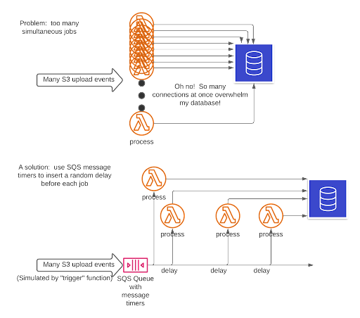

| Challenge name | Cloud(s) | Challenge goal | Contributor |
| :--- | :--- | :--- | :--- |
| "Flattening the curve": Architecting asynchronous processes on AWS | AWS | In this challenge, you will build a mechanism for triggering a burst of Lambda functions with some jitter in their start times so they aren’t all running simultaneously. You will understand a simple but reliable method to introduce jitter into a burst of cloud events, so that you can control their peak impact on downstream resources such as database connections or service limits such as Lambda concurrency. | [Jennine Townsend](https://twitter.com/jt7d) |

## Prerequisites
You will need just a little familiarity with AWS Lambda and the Lambda-supported programming language of your choice.

You will need to deploy a simple architecture; I suggest using CloudFormation or some similar tool, but you could build this in the console. You will also need to install the AWS CLI.

## Challenge steps

### Writing the "process" function

Recall the notion of "flattening the curve": if we have a resource that we don’t want to overwhelm, we will want to spread out calls on that resource to remain below its capacity.

Write a simple Lambda function called "process" that just pretty-prints the "event" structure it receives to the logs. Learn how to find the logs in CloudWatch Logs and learn how to see when it ran, and how long it took, and experiment with running it several times quickly. (Hint: study the AWS CLI command `aws lambda invoke --help`.)

See if you can run the function a dozen or many more times as quickly as possible. This Lambda function will be a stand-in for one that reads and processes PDF documents and writes information to a database.

### Simulate processing time
Update your "process" Lambda function to "sleep" for a few seconds, to simulate processing time. Trigger a few dozen of these as quickly as you can, including an event with a "document" key, and a different value for every event -- for example, you could use a shell loop around `aws lambda invoke` ...

But in a cloud context, the peak can be even steeper! Imagine that we offer a service to customers who upload PDF documents to us, and our "process" function summarizes the documents and inserts some information about each document into a database -- this is a pretty standard serverless use case.

But if a customer uploaded a hundred PDF documents at once, and all one hundred Lambda functions try to write to the database at once, we could cause a brief but very serious overload on the database! This is a common concern, and one with many possible solutions: for some ideas, read up on database connection pools and message queues.

### Monitor initial function behavior
Using the Lambda console’s "Monitor" tab for your "process" function, look at its graphs. Notice the height and duration of peaks, especially the "Invocations" and "Concurrent executions" graphs.

Experiment with changing how long the function sleeps (takes to process documents), and how rapidly you invoke a burst of them. See how the peaks change if you put even a brief pause between invocations, or if the function sleeps (processes) for different amounts of time.

### Create SQS queue
For this challenge, we will use a queue, and specifically Amazon’s Simple Queue Service (SQS). Read about SQS, and learn how to create a queue and give Lambda functions permission to write messages to and read messages from it (your deployment tool, eg SAM or Serverless.com for example, might help with this).

Create a queue, and write a Lambda function called "trigger" which sends five messages to it which have a `{ "document": 1234 }` shape of JSON event structure.

Set the "document" value to a counter, for example, so you can tell your five messages from each other `({ "document": 1 }` in the first one, `{ "document": 2 }` in the second one, and so forth).

Find the queue in the SQS console, and work out how to receive and view messages.

### Trigger Lambda function from queue
Set up the SQS queue as a trigger for the "process" function. Once the "process" function reads and logs messages from the queue, look at the logs and the SQS documentation to see how the `{ "document": 1234 }` structure appears in its logs. You will see a "Records" array since SQS can send multiple records to each Lambda invocation.

Decide how to handle this; in my use case, which is somewhat different, I limit the "process" Lambda function to receive an SQS batch size of 1, but you might decide to have your "process" Lambda function loop over "Records" and process each item. If you use the same database connection throughout, this can also help reduce the number of simultaneous connections.

### Experiment with the "trigger" function
Have it send five messages, ten, fifty, and see what the "process" function’s logs and graphs look like. See how tall the peaks get! Think about what that many "Concurrent executions" might mean for your database (or API limits, or licenses, or other resources).

### Incorporate message timer
Now read about [SQS message timers](https://docs.aws.amazon.com/AWSSimpleQueueService/latest/SQSDeveloperGuide/sqs-message-timers.html). This is a mechanism for sending a message, but asking SQS to delay delivering it just a bit. This sounds helpful!

Update your "trigger" function, adding a message timer to delay delivery by a random number of seconds between 10 and 100, say. See how this affects the graphs for the "process" function. Compare the height of the peaks with and without the delay.

There’s a cost to this method: you don’t finish the work for your customer for up to 100 extra seconds, almost two minutes. Is this OK for your use case? Will your customers mind? decision, and it’s important to include in the tradeoffs.

If the customer has a dashboard which shows progress, and (because we’re not overloading the database) that dashboard is fast and accurate, will that make them happy? See if they love an accurate animated progress bar.

### Automate monitoring
This is a very simple method of "flattening the curve", and once set up it is very reliable. But things change, and your customers may be uploading ever more documents. Or you may find that your delays are longer than you need, that your database has plenty of capacity and you could shorten the delays.

Using CloudWatch Metrics, set up alerts on the "Concurrent executions" metric that will warn you if the figure rises above 10, say, and then tweak the values in the "trigger" function to test the alert. While you’re there, set up alerts for "Error count", "Success rate", and other metrics you think need alerts.

## Extra credit
There are many other considerations when connecting cloud services in a robust and scalable way. Here are just a couple more rabbit holes you can explore using the infrastructure we've already set up.

### DLQs
[Read about Dead Letter Queues](https://docs.aws.amazon.com/AWSSimpleQueueService/latest/SQSDeveloperGuide/sqs-dead-letter-queues.html). Both Lambda and SQS can use Dead Letter Queues. Modify your "process" Lambda function to "fail" 10% of the time. Trigger it a few dozen times, and see what shows up in the DLQ. How might you automate monitoring a DLQ? How would you re-process items that show up there?

### Delay optimization
The "trigger" function knows how many jobs need to run, and it can know how long they usually take. Can you make it calculate what range of delays (above I suggested 10 to 100 seconds to start) it should use in order to achieve certain performance goals? These goals could include a specific maximum concurrency, say, or time until the last "process" function finishes.

Can you have it check CloudWatch to see how long the "process" function has actually been taking lately? Is there anything the "process" function could include in its logs that would help the "trigger" function calculate this, such as size of documents?

**Queueing theory** is the mathematics about queues and "waiting in line", and it has applicability in many areas of cloud resource management. You might want to follow up and read about it!

## 
Final takeaways
This challenge shows some real-world tradeoffs between synchronous revenue-producing production code, which is clearly important, and asynchronous delay-tolerant processes that are ... also important.
Making the effort to understand actual requirements often clarifies opportunities for simple and effective solutions. I've asked you to do the math for your performance expectations, and then verify the result, and set up ongoing monitoring. We've also demonstrated a few architectural principles -- pub/sub vs queue, jitter, queue behavior -- but there are many more! For a deep dive into how Anmazon applies these principles at scale, check out [this article from the Amazon Builder's Library](https://aws.amazon.com/builders-library/avoiding-overload-in-distributed-systems-by-putting-the-smaller-service-in-control/).

Be ready to answer questions! There are many ways to solve these problems, why not do it this other way? Educate yourself about those other ways! This is not a complex or fancy solution, it’s a simple solution using rock-solid cloud services that I’ll never have to fuss with.