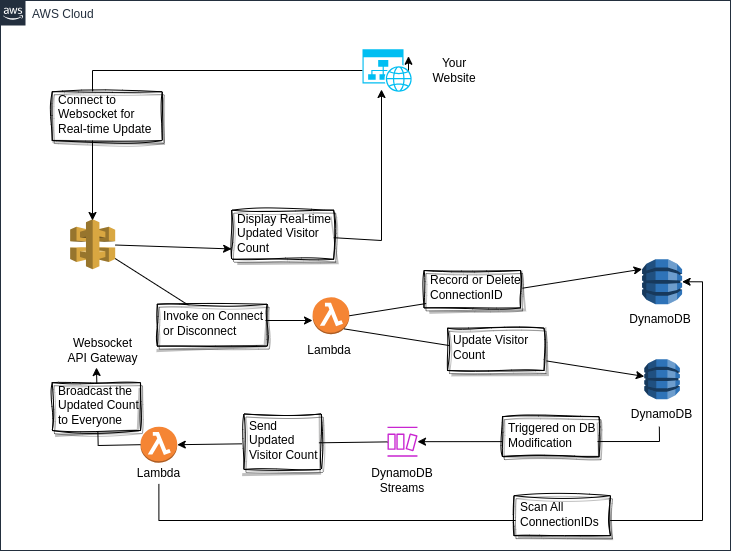

| Challenge name | Cloud(s) | Challenge goal | Contributor |
| :--- | :--- | :--- | :--- |
| Sending Updated Visitor Count to All Clients | AWS | In this challenge, you will build an event-driven architecture for your visitor-count service using DynamoDB Streams. Then, you will learn a mechanism to push updates to your clients using web sockets. | [Kaung Si Thu](https://www.linkedin.com/in/kaungsithu-kst/) |

## Introduction
The design of an HTTP/REST API is that you can do one request/response cycle with one API call. This leaves the visitors to your website with an old value of visitor count unless they refresh your website or unless your web app does polling. However, periodic polling will periodically invoke your Lambda functions and will cost you more than what you would like. Here, we will invoke our Lambda functions only when we need them while achieving the goal of updating the visitor count to all clients. The following is the diagram you can refer back to in case you are stuck during your challenge:

## Prerequisites
This challenge assumes that the challenger has already done the original cloud resume challenge. All we will be changing is the design of the visitor count service and the interaction between our web app and the new service. Before we begin, you can familarize yourself with RESTFul API and WebSocket API [in this video](https://www.youtube.com/watch?v=4vLxWqE94l4).

## Challenge steps

1. Delete your existing REST/HTTP API Gateway.
2. Delete your existing Lambda Functions. They could be in the form of GET and PUT Lambda Functions that interact with the `VisitorCount` table. 
3. Create a new WebSocket API Gateway, a new Lambda function (refer to this as `DBUpdater`), and a new DynamoDB table (refer to this as `ConnectionIDs`).
4. Write your web app to connect to this WebSocket API Gateway upon loading. You can learn how to use WebSocket in your JavaScript web app in [this MDN documentation on WebSocket](https://developer.mozilla.org/en-US/docs/Web/API/WebSocket). This should be useful for Step 10, too.
5. Route WebSocket's `$connect` and `$disconnect` routes to `DBUpdater`. You can read about AWS WebSocket Routes in this [AWS Documentation on WebSocket API routes](https://docs.aws.amazon.com/apigateway/latest/developerguide/websocket-api-develop-routes.html). 
6. `DBUpdater`, upon $connect, should write the connection ID of the web socket connection from the web app to the `ConnectionIDs` table, and increase the visitor count in the `VisitorCount` table. Upon $disconnect, the function should only delete the connection's ID from connectionID. [Hint: You might want to play around the event sent to `DBUpater` from WebSocket]
7. Enable DynamoDB Steam in the `VisistorCount` table. Therefore, a visitor will trigger this DynamoDB Stream because DBUpdater modifies the visitor count inside the table. Read more about DynamoDB Stream in [this official documentation](https://docs.aws.amazon.com/amazondynamodb/latest/developerguide/Streams.html).
8. Create another Lambda Function (refer to this as DBStreamProcessor), and make the DynamoDB Stream to invoke this DBStreamProcessor.
9. DBStreamProcessor should scan the connection IDs inside the `ConnectionIDs` table and send the updated count through WebSocket. I used NodeJS for this Lambda function because the official SDK support non-blocking functions. Here is the AWS official NodeJS SDK on [DynamoDB](https://docs.aws.amazon.com/AWSJavaScriptSDK/v3/latest/client/dynamodb/command/ScanCommand/) and [WebSocket](https://docs.aws.amazon.com/AWSJavaScriptSDK/v3/latest/client/apigatewaymanagementapi/).
10. Update your web app to listen to the socket and display the updated count!
11. Write a short blog on the programming languages and the SDKs you use in the Lambda functions and what you learn about what web sockets are capable of.

## Conclusion

The challenge provides hands-on experience with AWS services, showcasing the power of event-driven architectures and WebSocket communication to achieve real-time updates for visitor counts cost-effectively.

